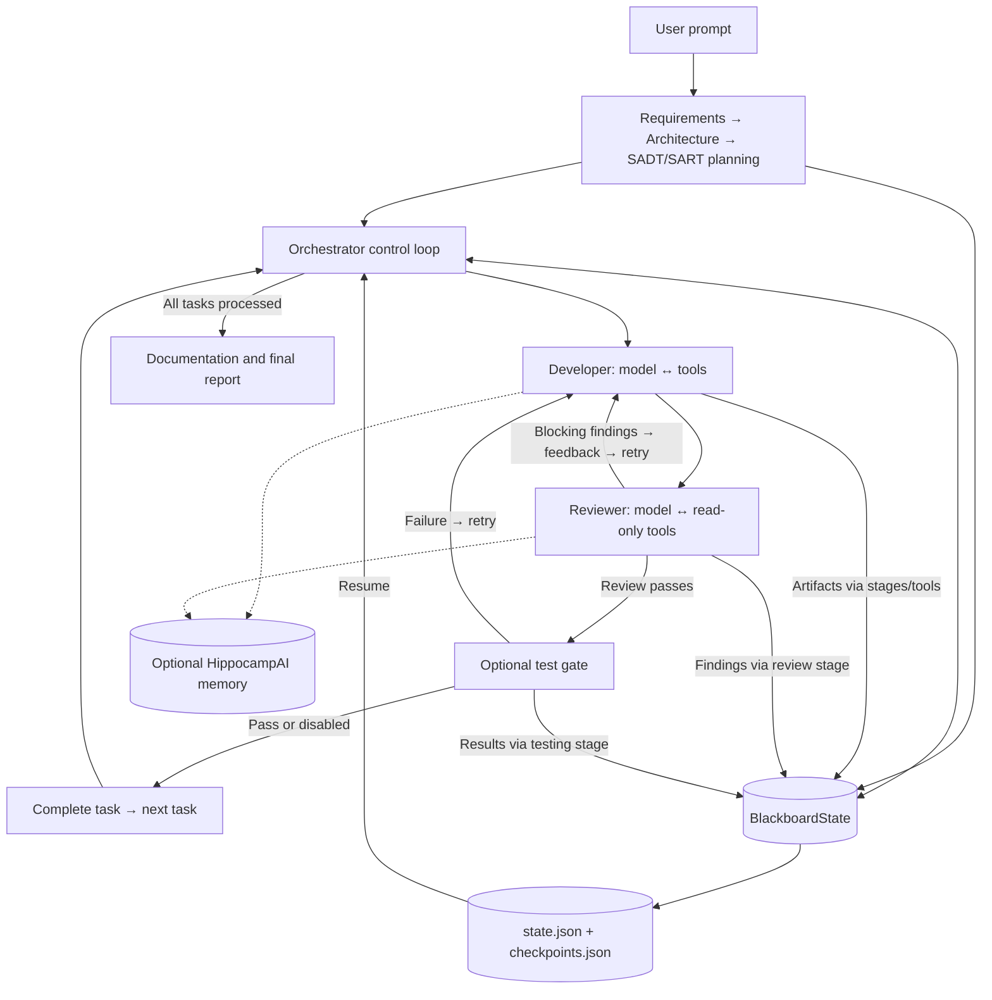

# AgentForge architecture

AgentForge coordinates specialized coding agents through shared blackboard state and
a centrally scheduled pipeline. The orchestrator decides when each stage runs;
developer and reviewer agents choose tools within their stages.

## What “blackboard-style” means here

The diagram is also available as an [exportable SVG](docs/evidence/architecture.svg)
and [Mermaid source](docs/evidence/architecture.mermaid).

The blackboard contains architecture, plan, file inventory, run command, completion
index, and task checkpoints. Orchestrator properties proxy to this object, so
extracted stages operate on shared state. Agents receive selected context; stage
code and tools publish their results.

A classical blackboard can activate independent knowledge sources when shared facts
satisfy preconditions. AgentForge uses explicit stage ordering instead. It currently
has no general event-driven activation engine, competing-agent scheduler, or
concurrent blackboard write protocol.

| Artifact | Publisher | Consumers | Persistence |
|---|---|---|---|
| Requirements | Requirements stage | Architect, planner, docs | Project requirements file |
| Architecture | Architecture stage | Planner, execution, testing | `state.json` |
| Atomic task plan | Planning stage | Orchestrator | `state.json` |
| Files / inventory | Tools and indexing | Developer, reviewer, validation | Workspace + state snapshot |
| Findings / retry history | Review stage and checkpoint methods | Next developer attempt, reporting | `checkpoints.json` |
| Test results | Optional testing stage | Retry logic, reporting | Task checkpoint |
| Completion index | Orchestrator | Resume logic | `state.json` |
| Cross-run memory | Orchestrator memory hooks | Context injection and recall tools | Optional memory service |

## Two levels of control

The inner loop is LlamaIndex's `ReActAgent`: ask the model, dispatch a tool, supply
the result, and continue until completion or a guard fires. AgentForge defines tools
and validation around that framework loop. Developer tools modify files; reviewer
tools inspect them and submit findings.

The outer loop selects a planned task, checkpoints progress, runs development,
validates artifacts, requests review, optionally tests, and retries or completes the
task. Review feedback becomes the next attempt's context. Repeated failures with no
progress can trigger configured model escalation. Execution agents currently cannot
append arbitrary follow-up tasks to the plan.

## Implementation map

| Concern | Source |
|---|---|
| CLI shim | [orchestrator.py](orchestrator.py) |
| Outer control loop and persistence | [aidev_orchestrator/orchestrator.py](aidev_orchestrator/orchestrator.py) |
| Shared state | [orchestrator_core/blackboard.py](orchestrator_core/blackboard.py) |
| Extracted stages | [orchestrator_core/pipeline/](orchestrator_core/pipeline/) |
| Tool-call and result contracts | [orchestrator_core/contracts/execution.py](orchestrator_core/contracts/execution.py) |
| Specialized agents and history | [agents/](agents/) |
| Validated file and memory tools | [aidev_orchestrator/orchestrator_tools.py](aidev_orchestrator/orchestrator_tools.py) |
| Versioned prompts | [prompts/](prompts/) |
| Skill selection | [aidev_orchestrator/skill_manager.py](aidev_orchestrator/skill_manager.py) |
| Optional persistent memory | [memory/hippocampai_client.py](memory/hippocampai_client.py) |

## Failure and recovery boundaries

- Zero-tool development completions are rejected; optional file verification checks
  expected artifacts. Critical/major review findings block completion.
- Reviewer tool errors invalidate review. Syntax-error findings receive a local
  syntax check; other findings are not independently proven correct.
- Timeouts, repeated-tool guards, bounded retries, and escalation limit some loops.
  Escalation requires configuration and uses heuristic thresholds.
- State/checkpoint files use temporary writes followed by replacement. Resume
  reconstructs task progress, not an exact in-flight model conversation.
- Git stash recovery is best effort: clean workspaces yield no stash savepoint, and
  applying a stash does not guarantee removal of failed-attempt artifacts.
- Validated file paths constrain tool access; generated-code execution is not fully sandboxed.

See [design decisions](docs/DESIGN_DECISIONS.md), [demo evidence](DEMO.md), and
[evaluation methodology](EVALUATION.md).
