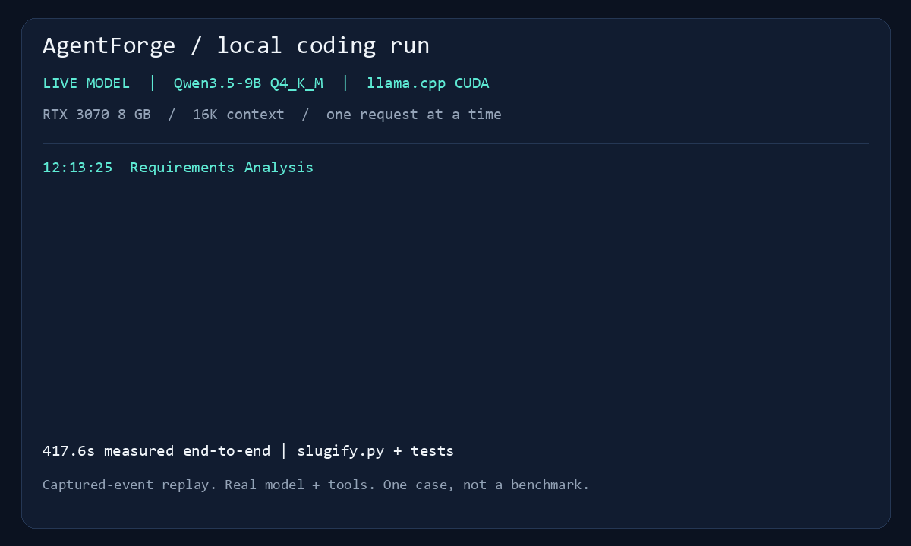
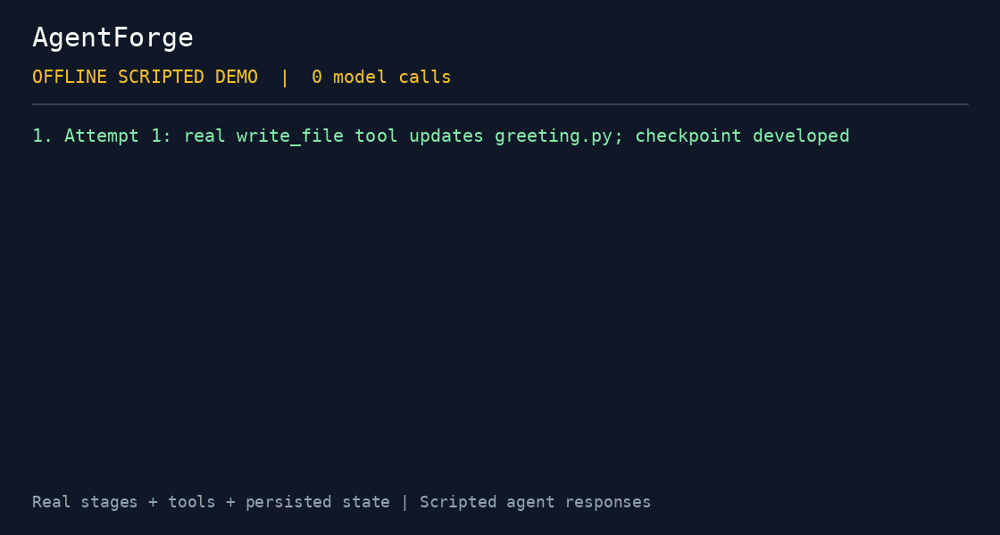

# AgentForge demo

## Local Qwen3.5-9B demo



The GitHub landing-page demo runs real AgentForge agents against Qwen3.5-9B
Q4_K_M through llama.cpp on an 8 GB RTX 3070. It uses a small slugifier task,
external acceptance checks, model-generated tests, and checkpoint restoration.
The GIF replays captured events, rather than recording the screen.

Follow the [local setup guide](docs/LOCAL_QWEN.md), start the server, then run:

```powershell
./.venv/Scripts/python.exe scripts/local_qwen_demo.py
```

See the [measured report](docs/evidence/local-qwen-demo/report.json) and
[unaltered generated code snapshots](docs/evidence/local-qwen-demo/generated/).
Raw traces, weights, and binaries are kept in ignored runtime directories.
This demonstrates one case; it does not establish general model reliability.

The recorded run completed three tasks in 417.6 seconds with one development
retry. All ten generated tests, independent acceptance checks, and checkpoint
restoration passed. The model also created an extra test-runner helper beyond
the prompt's three-file target; its unaltered snapshot is included in the evidence.

## Offline demo: failure → feedback → correction → restored checkpoint



The recording visualizes events captured from an actual offline demo execution.
Agent responses are scripted: **zero model calls**, with no claim about LLM quality.
Real file tools, development/review stages, conversation feedback, checkpoint writes,
and state restoration execute.

```bash
python -m pip install -e .[dev]
python scripts/portfolio_demo.py
```

1. A scripted developer creates `greeting.py` with a whitespace bug.
2. A scripted reviewer reads it and returns a blocking finding.
3. The review stage stores feedback, increments retry count, and marks the task pending.
4. The next developer prompt contains feedback; `replace_text` fixes the file.
5. Review passes; an assertion checks `greet(" Ada ") == "Hello, Ada!"`.
6. State and checkpoints load into a fresh orchestrator object with retry history intact.

The curated [event record](docs/evidence/offline-demo.json) excludes raw prompts,
credentials, and temporary paths. The temporary workspace is removed after execution.
Planning, Git rollback, embeddings, and persistent memory are outside this demo.

Install Pillow and run `python scripts/render_demo_recording.py` to regenerate the
animated event recording. It is a visualization of captured events, not a screen capture.

## Live demo

Install a provider extra and configure a model as described in the [README](README.md).

```bash
python orchestrator.py demo_project --prompt examples/prompts/demo_prompt.txt --new
```

PowerShell helper: `./scripts/demo_run.ps1`. Add `--with-tests` for the optional
testing stage or `--google` for the configured Google provider.

Generated files land in `projects/demo_project/workspace/`; state/checkpoints remain
under `projects/demo_project/`, and traces under `logs/`. These outputs are ignored.

For a two-minute live screen recording, show the selected model, tool calls, review
outcome, checkpoint, and generated artifact. When retry occurs, show feedback and
the corrected diff. Model-generated review failures are not guaranteed; report the
actual outcome even if incomplete. Attach [external acceptance checks](EVALUATION.md).
